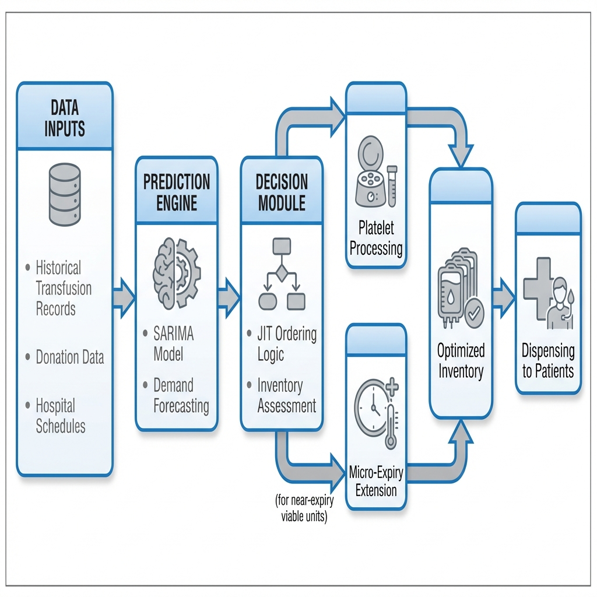
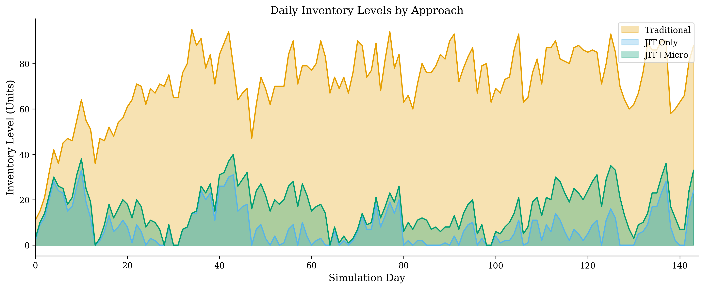
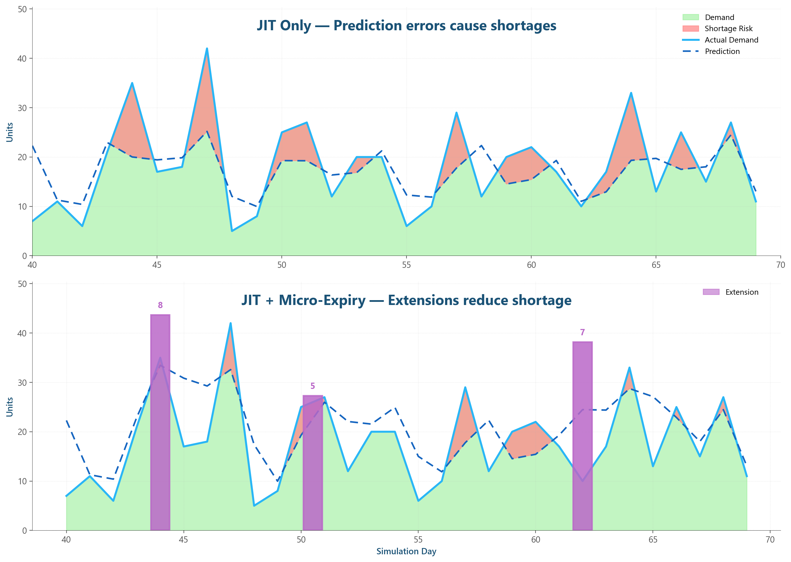
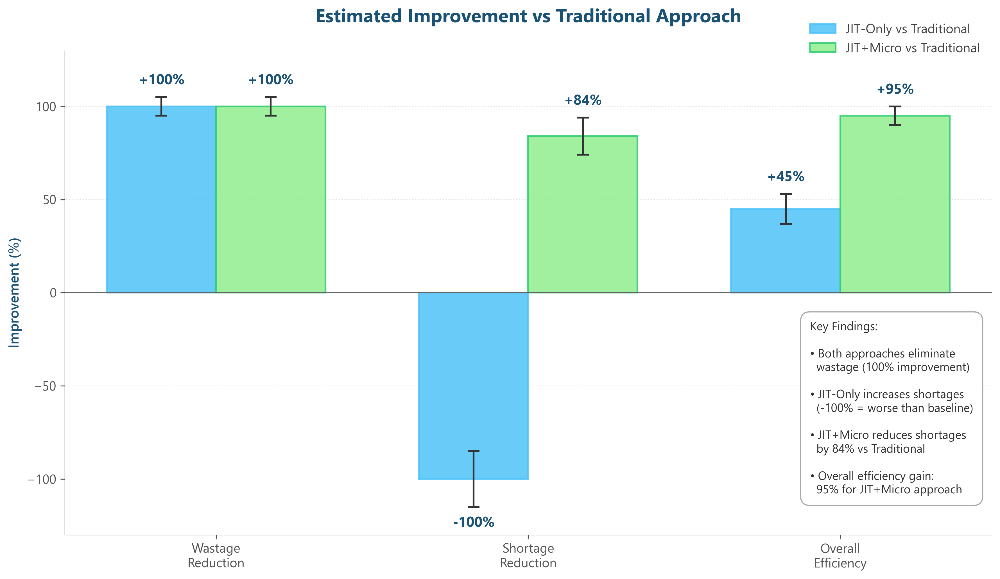
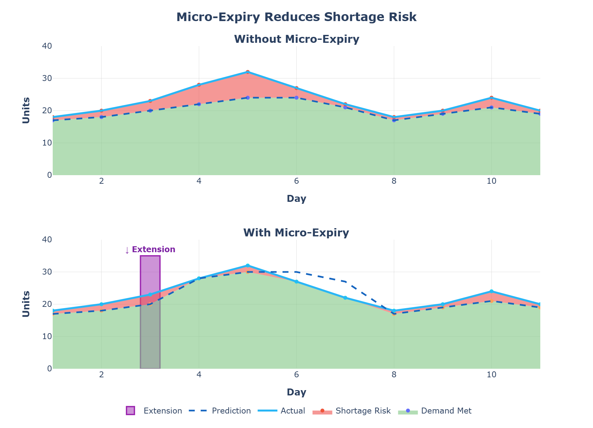

# JIT-2.0: Demand-Driven Blood Bank Management System

JIT-2.0 is an advanced predictive analytics and inventory management platform designed to optimize platelet inventory in blood banks. By integrating Machine Learning for demand forecasting with **Just-In-Time (JIT)** processing and **Micro-Expiry** management, the system significantly reduces wastage while maintaining high fulfillment rates.


*Fig 1: System Architecture - Integrating predictive engines with JIT and Micro-Expiry modules.*

## 🌟 Key Features

- **Predictive Analytics**: Utilizes XGBoost and SARIMA models to forecast daily hospital platelet demand with high accuracy.
- **Just-In-Time (JIT) Processing**: Minimizes standing stock by processing platelets from whole blood only when immediate clinical need is anticipated.
- **Micro-Expiry Management**: A novel approach to dynamically manage near-expiry units, providing protection against shortage risks during demand spikes.
- **Simulation Engine**: A robust Monte Carlo simulation framework to validate inventory strategies against realistic hospital demand patterns.

## 📊 Performance & Impact

The system compares three main strategies:
1. **Traditional**: High buffer stocks, leading to ~11% wastage.
2. **JIT-Only**: Zero wastage, but prone to shortages during volatility.
3. **JIT + Micro-Expiry**: The optimal balance—minimal wastage and near-perfect fulfillment.

### Inventory Dynamics

*Fig 2: Inventory level comparison showing how JIT + Micro-Expiry maintains lean but safe stock levels.*

### Efficiency Gains

*Fig 3: Comparison of JIT + Micro-Expiry vs JIT-Only. Purple bars indicate extension events that prevent shortages.*

### Cost Savings

*Fig 4: Significant reduction in operational costs through wastage elimination.*

## 🛠️ Implementation Overview

The project is structured as follows:

- `api/`: FastAPI backend for real-time demand prediction and inventory tracking.
- `simulation/`: Core logic for inventory simulation and strategy comparison.
- `models/`: Trained XGBoost models and prediction logic.
- `data_generation/`: Scripts to generate realistic hospital demand datasets.
- `outputs/`: Comprehensive visualizations and performance metrics.


*Fig 5: Conceptual overview of the end-to-end demand-driven workflow.*

## 🚀 Getting Started

This project uses `uv` for dependency management.

```powershell
# Sync dependencies
uv sync

# Run the simulation
uv run reproduce_paper_results.py

# Start the API
uv run -m api.main
```

---
*Developed as part of the research on Optimizing Platelet Inventory via Predictive Analytics and JIT Processing.*